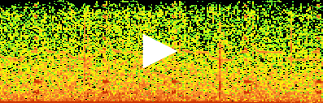

# smartbay-audio-player
This is a simple widget to play audio .wav files from the server, and display
a corresponding spectrogram.

The widget is for use at the [smartbay website](//smartbay.marine.ie), but may have other applications.
In general it works by http polling an index page, and extracting the links to
.wav files.

# Example
[](//irishmarineinstitute.github.io/smartbay-audio-player/)

# Usage
Include the smartbay-audio-player.js somewhere near the top of your html page.
```
<script  type="text/javascript" src="smartbay-audio-player.js"></script>
```

Then somewhere after that, create a new SmartbayAudioPlayer, giving the id of the element into
which the player should be placed, and any options.

```javascript
var player = new SmartbayAudioPlayer('player',{height:128,width:400});
```

The following options are supported:
- height:
	- pixel height of the canvas section of the player.
	= default: 128
- width:
  - pixel width of the canvas section of the player.
	- default: 128
- debug:
	- show some extra information on the screen
	- default: false
- infoClassName:
	- css class to use for info section
	- default: text-info
- errorClassName:
	- css class to use for the error section
	- default: text-danger
- baseUrl:
	- website under which the index page is found
	- default: [//spiddal.marine.ie/data/audio/ICListenRecordings/](//spiddal.marine.ie/data/audio/ICListenRecordings/)
- indexUrlFunction:
  - a javascript function to calculate the index page url from the baseUrl
	- default: appends date string in format yyyy/mm/dd/
- extractUrlsFunction:
	- a javascript function which accepts the index page content and index page url and returns an array of wav urls.
	- default: extract the hrefs with .wav endings, and prepend the index page url.
